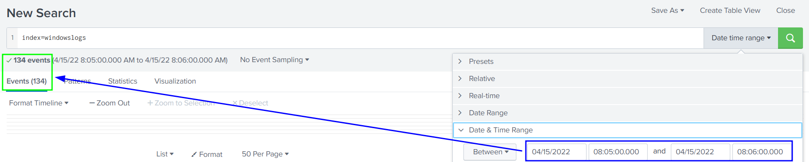

## Room Goals:
- What are Search processing Language?
- How to apply filters to narrow down results.
- Using transformational commands.
- Changing the order of the results.

## Notes

SPL Comments: enclose in "```"

#### Filtering Results
`index=windowslogs | fields + host + User + SourceIp`
- spell the fields correctly (case sensitive)

`index=windowslogs | search Powershell`
- search raw text with pipe

`dedup`
- remove duplicate fields

`rename XYZ as ABC`
- change name of field XYZ to ABC

#### Structuring Results
`| table <field_name1> <fieldname_2>`

#### Transforming Searches
`| top limit=<#> <field_name>`
- frequent values
`| rare limit=<#>> <field_name>`
- opposite of `top`, rare values

`highlight <field_name1> <field_name2>`
- highlight fields in raw events mode


## Questions
What is the name of the host in the Data Summary tab?
- cyber-host


In the left field panel, which Source IP has recorded max events?
- 172.90.12.11


How many events are returned when we apply the time filter to display events on 04/15/2022 and Time from 08:05 AM to 08:06 AM?
- 134



How many Events are returned when searching for Event ID 1 AND User as *James*?
- 4
- `index=windowslogs EventID="1" AND User=*James*`

How many events are observed with Destination IP 172.18.39.6 AND destination Port 135?
- 4 
- `index=windowslogs DestinationIp="172.18.39.6" AND DestinationPort="135"`

What is the Source IP with highest count returned with this Search query?
Search Query: index=windowslogs  Hostname="Salena.Adam" DestinationIp="172.18.38.5"
- 172.90.12.11


In the index windowslogs, search for all the events that contain the term cyber how many events returned?
- 0 
- `index=windowslogs cyber`

Now search for the term cyber*, how many events are returned?
- 12256
- `index=windowslogs cyber*`

What is the third EventID returned against this search query?
Search Query: `index=windowslogs | table _time EventID Hostname SourceName | reverse`
- 4103

Use the dedup command against the Hostname field before the reverse command in the query mentioned in Question 1. What is the first username returned in the Hostname field?
- Salena.Adam
```
index=windowslogs 
| table _time EventID Hostname SourceName 
| dedup Hostname 
| reverse
```

Using the Reverse command with the search query `index=windowslogs | table _time EventID Hostname SourceName` - what is the HostName that comes on top?\
- James.browne

What is the last EventID returned when the query in question 1 is updated with the tail command?
- 4103

Sort the above query against the SourceName. What is the top SourceName returned?
- Microsoft-Windows-Directory-Services-SAM
- `index=windowslogs | table _time EventID Hostname SourceName | sort SourceName`

List the top 8 Image processes using the top command -  what is the total count of the 6th Image?
- 196
- `index=windowslogs | top limit=8 Image`

Using the rare command, identify the user with the least number of activities captured?

Create a pie-chart using the chart command - what is the count for the conhost.exe process?