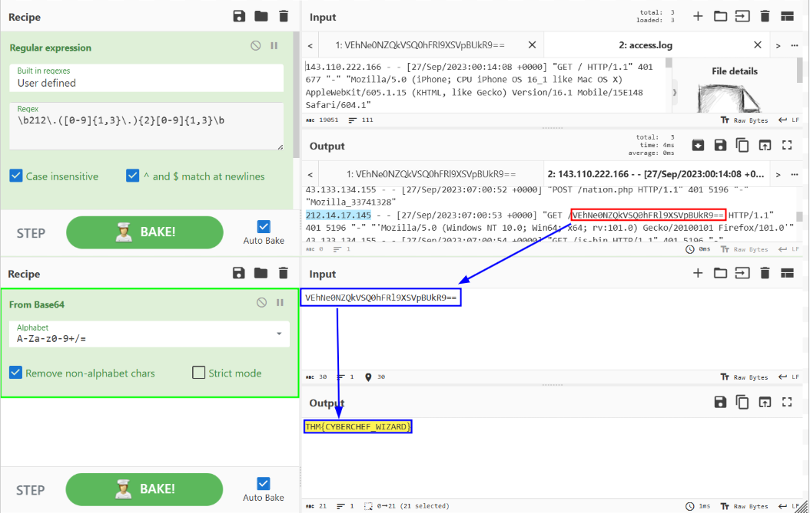
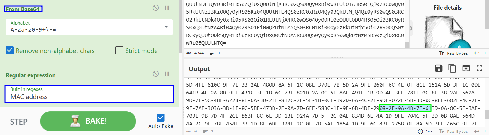

## Room goals:
- Learn log analysis best practices.
- Discover the essential tools for log analysis.
- Gain hands-on experience in analyzing logs by using multiple tools and technologies.

## Notes

common log file locations:
Web Servers:
- Nginx:
    - Access Logs: /var/log/nginx/access.log
    - Error Logs: /var/log/nginx/error.log
- Apache:
    - Access Logs: /var/log/apache2/access.log
    - Error Logs: /var/log/apache2/error.log
Databases:
- MySQL:
    - Error Logs: /var/log/mysql/error.log
- PostgreSQL:
    - Error and Activity Logs: /var/log/postgresql/postgresql-{version}-main.log
Web Applications:
- PHP:
    - Error Logs: /var/log/php/error.log
Operating Systems:
- Linux:
    - General System Logs: /var/log/syslog
    - Authentication Logs: /var/log/auth.log
Firewalls and IDS/IPS:
- iptables:
    - Firewall Logs: /var/log/iptables.log
- Snort:
    - Snort Logs: /var/log/snort/

[XSS payload list](https://github.com/payloadbox/xss-payload-list)

[SQL Injection payload list](https://github.com/swisskyrepo/PayloadsAllTheThings/tree/master/SQL%20Injection)

[Directory Traversal payload list](https://github.com/swisskyrepo/PayloadsAllTheThings/blob/master/Directory%20Traversal/README.md)

Automated Analysis tools: XPLG, Solarwinds Loggy

`wc`
- output of wc provides information about the number of lines, words, and characters in a log file

`cut`
-  extracts specific columns based on specified delimiters

`sort`
- arranges the data in files in ascending or descending order based on specific criteria
- `-n` numerically

`uniq`
- identifies and removes adjacent duplicate lines
- combine with `sort` before 
- `-c` count

`grep`
- `v` option invert search
- `E` regex
- [reference](https://www.gnu.org/software/grep/manual/grep.html)

[Regex tool](https://regexr.com/)

Grok, Logstash, [Sigma](https://github.com/SigmaHQ/sigma), Yara

## Questions
What's the term for a consolidated chronological view of logged events from diverse sources, often used in log analysis and digital forensics?
- Super Timeline

Which threat intelligence indicator would `5b31f93c09ad1d065c0491b764d04933` and `763f8bdbc98d105a8e82f36157e98bbe` be classified as?
- File Hashes

What is the default file path to view logs regarding HTTP requests on an Nginx server?
- Access Logs: /var/log/nginx/access.log

A log entry containing %2E%2E%2F%2E%2E%2Fproc%2Fself%2Fenviron was identified. What kind of attack might this infer?
- Path Traversal

A log file is processed by a tool which returns an output. What form of analysis is this?
- Automated

An analyst opens a log file and searches for events. What form of analysis is this?
- Manual

Use `cut` on the `apache.log` file to return only the URLs. What is the flag that is returned in one of the unique entries?
- c701d43cc5a3acb9b5b04db7f1be94f6
- `cut -d ' ' -f 7 apache-1691435735822.log`

In the `apache.log` file, how many total HTTP 200 responses were logged?
- 52
- `cut -d ' ' -f 9 apache-1691435735822.log | sort | uniq -c`

In the apache.log file, which IP address generated the most traffic?
- 145.76.33.201
- `cut -d ' ' -f 1 apache-1691435735822.log | sort | uniq -c | sort -n -r`

What is the complete timestamp of the entry where `110.122.65.76` accessed `/login.php`?
- 31/Jul/2023:12:34:40 +0000
- `cat apache-1691435735822.log | grep 110.122.65.76 | cut -d ' ' -f 4,5,7 | grep login`

How would you modify the original `grep` pattern above to match blog posts with an ID between 20-29?
- post=2[0-9]

What is the name of the filter plugin used in Logstash to parse unstructured log data?
- Grok

Upload the log file named "access.log" to CyberChef. Use regex to list all of the IP addresses. What is the full IP address beginning in 212?
- 212.14.17.145
- `\b212\.([0-9]{1,3}\.){2}[0-9]{1,3}\b`

Using the same log file from Question #2, a request was made that is encoded in base64. What is the decoded value?
- THM{CYBERCHEF_WIZARD}

Using CyberChef, decode the file named "encodedflag.txt" and use regex to extract by MAC address. What is the extracted value?
- 08-2E-9A-4B-7F-61

What languages does Sigma use?
- YAML

What keyword is used to denote the "title" of a Sigma rule?
- title

What keyword is used to denote the "name" of a rule in YARA?
- rule